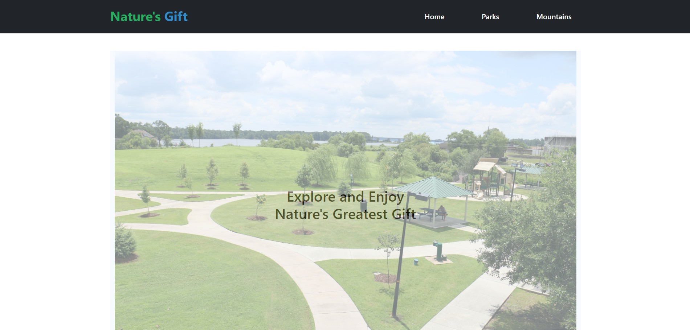
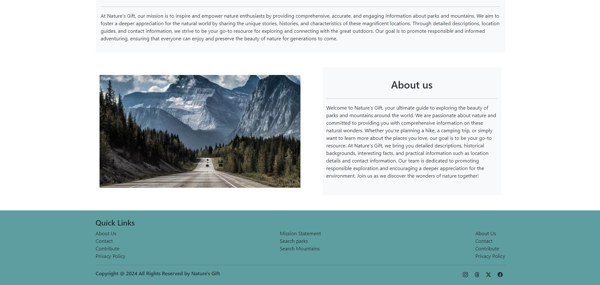
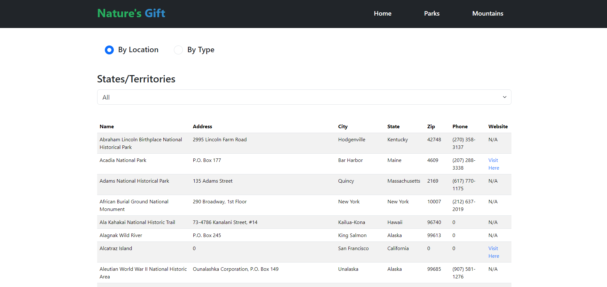
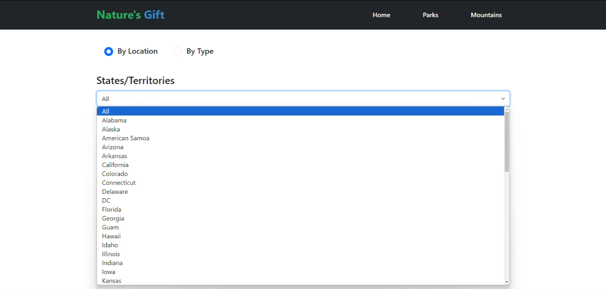
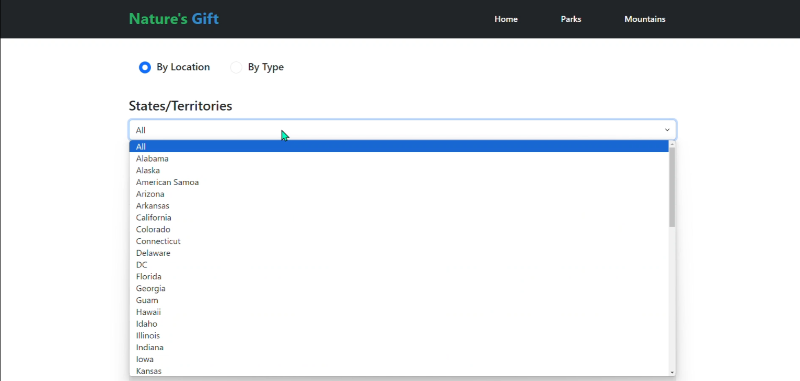
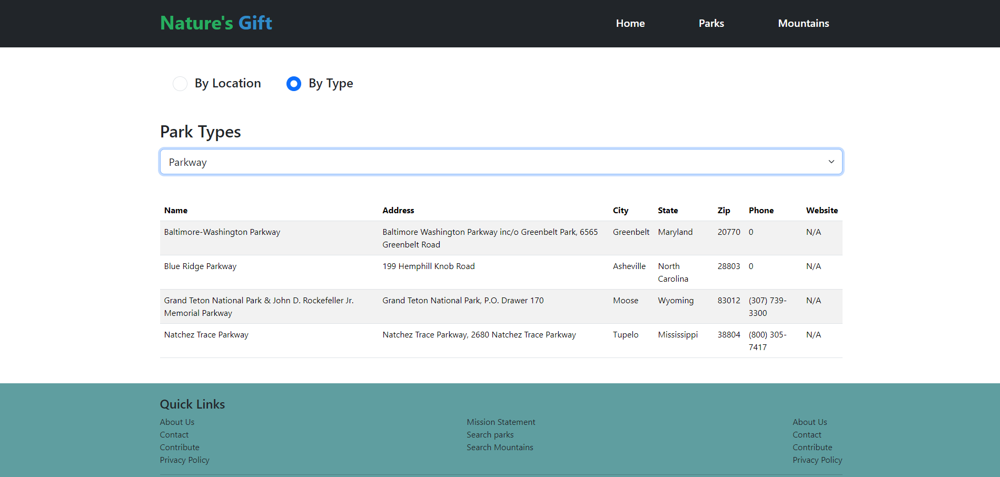
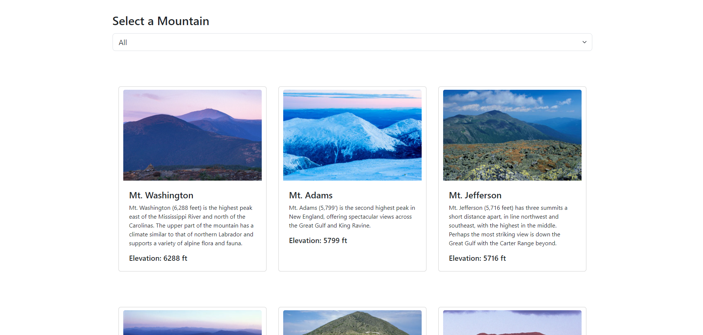
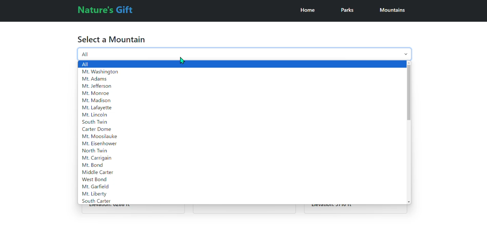
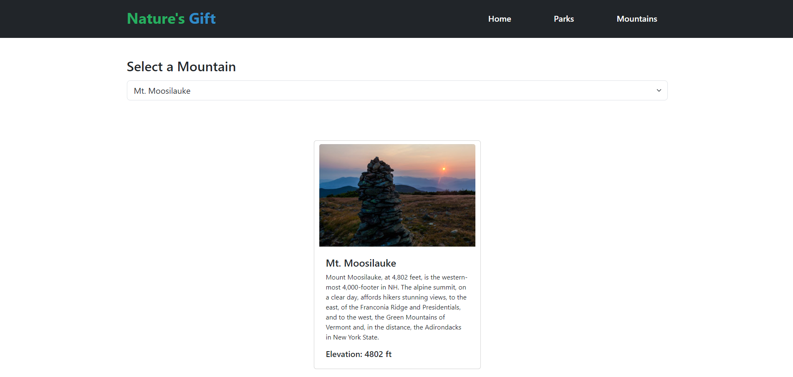

# Enjoy The Outdoors

Nature's Gift is a project that provides comprehensive information about parks and mountains around the United States of America. Whether you're planning a hiking trip, a camping adventure, or simply want to learn more about the natural wonders of our planet, Nature's Gift aims to be your ultimate guide.

## Table of Contents

- [Project Overview](##project-overview)
- [Technologies](#technologies)
- [Images](#images)
- [Interesting Piece of Code](#interesting-piece-of-code)

## Project Overview

Given multiple arrays (individual JavaScript files) containing information about parks and mountains in the United States, I must be able use our understanding of JavaScript and multiple resources to create a website that provides the user the given information (parks/mountains). In this project I used JavaScript to create a toggle radio button, when clicked either button, it will change the dropdown list to the appropriate list from the given array (states array/park types). After selecting the desired list and choosing one of the option, I created multiple functions so that not only does the options show in the select HTML element, but also accessed the contents within the array to place each value into the table. This was achieved by using both HTML and JavaScript, HTML was used to create the table element and the table head, and JavaScript was used to create row elements that are appended to their respective parent element. The contents inside of the row (cell items) are then added using .innerText. Similarly as the parks page, the mountains page works almost the same way, however, a table is not used, rather, using styling, I created bootstrap cards and displayed them alongside each other when the "All" option is selected.


## Technologies

- HTML
- CSS
- JavaScript
- Bootstrap

## Images
Below you will see a few images showing my project as well as a brief explanation of what the page is showing and what was used to create the page.

- 
- 
1. Home Page Design with Header and Footer, using Bootstrap and custom CSS styles

- 
- 
2. Showing all Park Locations (States) table at opening of page, location radio button is set at default. Dropdown shows all states that come from the given array.

- 
- 
3. Shows all parks initially (locations and types options do this). Displays dropdown options from the given array. When selecting an option, the function that was created, will filter the data and only show those parks that match the name of the option and it must contain the same name in the park name.

- 
- 
- 
4. At start of page, it will displays all of the mountains in cards side by side with even spacing along with an image and description of each card. When clicking on the select HTML element (dropdown button), it displays the items (mountain names) from the given array as well as an all option to display all the cards (bootstrap cards) if an individual card was selected. If a mountain name was selected from the dropdown, it will only show that mountain card.

## Interesting Piece of Code

```
    let cardContainer = document.createElement("div");
        cardContainer.classList.add("container");
        cardContainer.classList.add("card");
        cardContainer.classList.add("my-5");
        cardContainer.style = "width: 25rem";
        cardContainer.id = "cardContainer";
```

The reason why I find this interesting is because, at first I didn't know that it was possible to create a class after creating a div. For example...
```
    <div class="container"></div>
```
After seeing this and being able to practice, I feel more confident in using this and even tried doing the same thing with style and creating id attributes as well. I am now able to use this information and continue discovering many other ways to add this functionality.

### Go to Table of Contents?
- [Table of Contents](#table-of-contents)